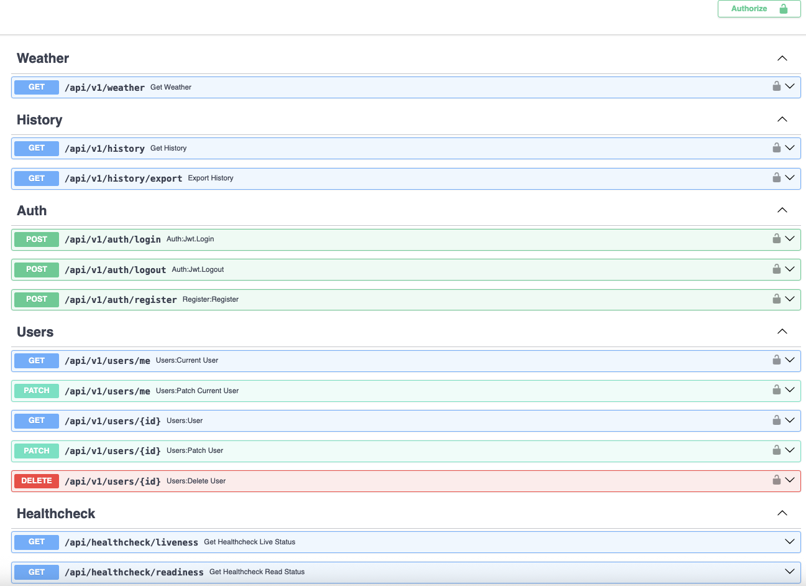
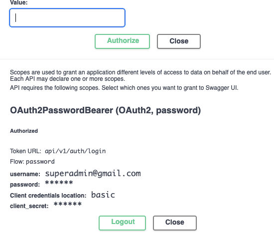
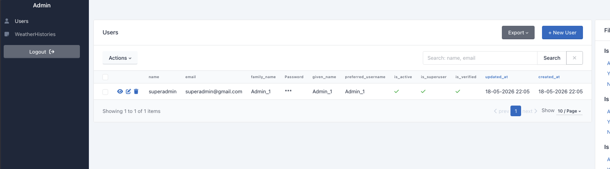
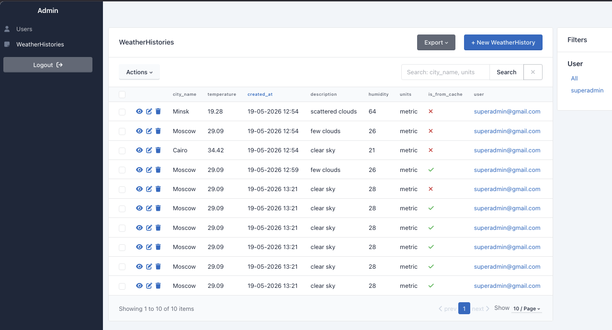

# Weather Query — Тестовое задание
[](https://www.python.org/)
[](https://github.com/jerryjuiceme/weather-query-test-task/commits)

Простое веб-приложение, которое позволяет пользователям вводить название города, получать актуальные данные о погоде через публичный API (OpenWeatherMap) и сохранять и просматривать историю запросов с использованием PostgreSQL. Выполнено в рамках тестового задания.

* * *

## Важно / Disclaimer

**Об аутентификации:** В задании указано **"The application must use PostgreSQL to store user queries"**. Поскольку хранить и отдавать пользовательские данные без какого-либо контроля доступа небезопасно, я добавил простую JWT-аутентификацию и авторизацию с использованием FastAPI Users. Таким образом, каждый пользователь получает только свои данные, а администратор имеет полный доступ.

**Об использовании ИИ:** Весь основной код приложения написан без помощи ИИ. Небольшая помощь использовалась при написании seed/bash-скриптов, при подготовке этого README и в некоторых моментах рефакторинга. Весь архитектурный стиль основывается на личном boilerplate, собственных реализациях и сниппетах, а также на отдельных open-source решениях. Агентное AI-кодирование не применялось.

* * *

## Стек

| Область | Технология |
| --- | --- |
| Язык | Python 3.13 |
| Менеджер зависимостей | UV |
| Фреймворк | FastAPI |
| Кэш | Redis (Valkey) / redis.asyncio |
| База данных | PostgreSQL 16 |
| ORM | SQLAlchemy + Asyncpg |
| Миграции | Alembic |
| HTTP-клиент | HTTPX |
| Валидация / DTO / схемы | Pydantic |
| Логирование | Structlog |
| Retry | Stamina |
| Rate limiting | Waygate |
| Контейнеризация | Docker / Docker Compose |

* * *

## Быстрый старт

### Требования

- [UV](https://docs.astral.sh/uv/) с Python 3.13
- Docker (Engine или Desktop)
- POSIX-совместимая система (Linux / macOS)

Все команды управляются через `Makefile`.

### Инициализация проекта

```sh
git clone https://github.com/jerryjuiceme/weather-query-test-task
cd weather-query-test-task

make init
```

Скрипт запросит OpenWeatherMap API-ключ. После этого инициализируется проект, создаётся виртуальное окружение и генерируется файл `.env`.

### Запуск локально

```sh
make run
```

Запускает entrypoint-скрипт, применяет миграции базы данных и создаёт суперпользователя (admin).

### Запуск в Docker (рекомендуемый способ!)

```sh
make run-in-docker
```

Поднимает весь стек приложения в изолированной Docker Compose сети.

* * *

## API

Хост: `http://localhost:8000`

Swagger UI: `http://localhost:8000/docs`

Админка: `http://localhost:8000/admin`

### Основные URI бизнес-логики

| Метод | URI | Описание |
| --- | --- | --- |
| GET | `/api/v1/weather` | Возвращает данные о погоде для запрашиваемого города и выбранной системы единиц |
| GET | `/api/v1/history` | Возвращает пагинированную историю запросов авторизованного пользователя |
| GET | `/api/v1/history/export` | Стриминг CSV-файла с историей запросов пользователя (с применением фильтров, если они заданы) |

Также доступны несколько ручек для аутентификации и входа.



### Авторизация

JWT-аутентификация с использованием Bearer-транспорта, реализованная через FastAPI Users. Используется только `access_token` — без refresh-токенов.

Каждый эндпоинт бизнес-логики требует авторизации. Способы аутентификации:

1. Воспользоваться кнопкой Authorize в Swagger UI, или
2. Отправить запрос `POST /api/v1/auth/login`, получить токен и передавать его в заголовке последующих запросов:

```sh
-H 'Authorization: Bearer <token>'
```

Для быстрого входа используйте базовые креды суперпользователя (создаются автоматически через entrypoint):

```
EMAIL=superadmin@gmail.com
PASSWORD=superadmin
```



### Health checks

Реализованы 2 пробы для проверки работоспособности реплики: `liveness` и `readiness`.

`GET /api/healthcheck/liveness` — подтверждает, что приложение отвечает:

```json
{
  "status": "healthy"
}
```

`GET /api/healthcheck/readiness` — проверяет все интеграции. Если хотя бы один сервис недоступен, общий статус возвращается как `unhealthy`:

```json
{
  "status": "healthy",
  "service": [
    { "service": "db", "status": "healthy" },
    { "service": "redis", "status": "healthy" },
    { "service": "openweathermap", "status": "healthy" }
  ]
}
```

* * *

## Архитектура

### Модульность

Приложение построено на слоистой архитектуре с паттерном Repository для абстракции доступа к данным и сервисным слоем, где сосредоточена основная бизнес-логика.

### База данных

PostgreSQL 16 с SQLAlchemy в качестве ORM и Asyncpg в качестве драйвера. Миграции реализованы через Alembic. Primary key — UUID7. Дополнительного контроля транзакционности сверх стандартной SQLAlchemy-сессии для данного объёма не требуется.

### Кэш

Интеграция с Redis реализована через `redis.asyncio` с собственным **абстрактным классом кэша** — это позволяет легко подключать альтернативные реализации хранилища без изменений в сервисах. Кэш применяется только в `src/services/http/weather.py` (запрос к внешнему weather API), TTL — 5 минут.

Если Redis недоступен во время работы — запрос всё равно выполнится, обратившись напрямую к внешнему API. Для тестов предусмотрена реализация `InMemoryCache`.

Пример ответа с данными из кэша:

```json
{
  "cityName": "Minsk",
  "temperature": 16.01,
  "description": "few clouds",
  "humidity": 83,
  "units": "metric",
  "isFromCache": true,
  "requested_at": "2026-05-19 17:04:15"
}
```

### Rate Limiting

Эндпоинт `GET /api/v1/weather` ограничен по частоте запросов с помощью библиотеки [Waygate](https://attakay78.github.io/waygate/tutorial/rate-limiting/) с Redis-бэкендом (для синхронизации состояния между репликами). Стратегия: per IP, 30 запросов в минуту. При достижении лимита сервис отвечает `429`:

```json
{
  "code": "string",
  "message": "string",
  "limit": 0,
  "retry_after_seconds": 0,
  "reset_at": "2026-05-19T17:04:15.463Z",
  "path": "string"
}
```

Если Redis недоступен при старте приложения — rate limiter автоматически переходит в режим in-memory.

### Логирование

Структурированное централизованное логирование через Structlog в машиночитаемом формате `key=value`. Контекстные переменные (request ID, метод, путь, маршрут, IP клиента, user agent) биндятся на каждый запрос через middleware и прокидываются по всей цепочке вызовов. Логи ошибок Uvicorn и Gunicorn также подключены к Structlog. Задержка ответа от внешнего API логируется отдельно в `src/services/http/weather.py`.

```python
async def per_request_middleware(request: Request, call_next):
    structlog.contextvars.clear_contextvars()

    request_id = str(uuid.uuid4())
    route = request.scope.get("route")
    structlog.contextvars.bind_contextvars(
        request_id=request_id,
        method=request.method,
        path=request.url.path,
        route=route.path if route else request.url.path,
        client_ip=request.client.host if request.client else None,
        user_agent=request.headers.get("user-agent"),
    )
```

### Внешний API

Интеграция с OpenWeatherMap реализована в виде репозитория с использованием HTTPX с **персистентным соединением**, оформленным как контекстный менеджер в lifespan приложения. В основном методе `fetch_weather` реализован retry через Stamina — удобную обёртку над Tenacity с батарейками в комплекте.

### Обработка ошибок

В соответствии со слоистой архитектурой реализовано дерево ошибок, которые поднимаются на нужных уровнях приложения. Все поднятые ошибки и исключения отлавливаются в error-хендлерах и обрабатываются на сервисном слое.

* * *

## Контейнеризация

Dockerfile использует **мультистейдж-сборку** и производит два образа: один для тестов, один для продакшена. Готовый production-контейнер весит около 380 МБ.

* * *

## Тестирование

### Стек

Pytest, Polyfactory, TestContainers, `unittest.MagicMock`, Dirtyequals

### Дизайн тестов

В проекте реализовано **102 теста**.

Тесты репозиториев и E2E-тесты API поднимают реальные TestContainers для PostgreSQL и Redis. Фикстуры для TestContainers находятся в `fixtures_testcontainer.py`. Тесты сервисов и бизнес-логики мокируют все репозитории.

Запустить тесты локально:

```sh
make test
```

Запустить тесты в изолированной Docker-среде с использованием специально собранного тестового образа:

```sh
make test-in-docker
```

Тестовая среда определяется переменной `TEST_ENV` (`CONTAINER` или `REAL`). Если базы данных недоступны — тесты, требующие реального подключения, будут аккуратно **пропущены** (Skipped, около 59 штук), а не упадут. Это удобно на различных этапах CI-пайплайна.

* * *

## Extra: Админка

Подключена [SQLAdmin](https://github.com/smithyhq/sqladmin) для быстрого и удобного доступа к собираемым данным и данным пользователей.

Для входа используйте базовые креды суперпользователя:

```
EMAIL=superadmin@gmail.com
PASSWORD=superadmin
```





* * *

## Make-команды

| Команда | Описание |
| --- | --- |
| `make init` | Инициализация проекта: запускает `seed/init.sh`, настраивает окружение и генерирует `.env` |
| `make run` | Запускает Postgres и Redis в Docker, выполняет entrypoint-скрипт локально, стартует приложение |
| `make run-in-docker` | Поднимает весь стек (включая приложение) в Docker Compose |
| `make test` | Запускает тесты локально через pytest и TestContainers |
| `make test-in-docker` | Запускает тесты в изолированной Docker-среде с тестовым образом |
| `make up-docker` | Запускает только контейнеры Postgres и Redis |
| `make migrate` | Применяет миграции Alembic (`alembic upgrade head`) |
| `make seed-admin-user` | Применяет миграции и создаёт суперпользователя |